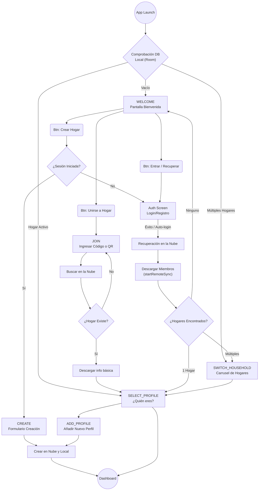

# Documentación de Flujos de Inicio en AppCasa

## Esquema General de Flujos

El siguiente diagrama ilustra la máquina de estados de la pantalla inicial, mostrando cómo el usuario navega dependiendo de su estado de autenticación y de los datos locales de la base de datos `appcasa_db_secure`.

Esta documentación describe en detalle todos los flujos disponibles en la pantalla inicial de la aplicación (`HouseSetupScreen` y `AuthScreen`), explicando cómo interactúan los diferentes estados, el manejo de la base de datos local y la nube (Firebase).

## 1. Funcionamiento con Datos Almacenados en Local (Auto-Login)

Al abrir la aplicación, el `HouseSetupViewModel` evalúa de inmediato el estado del almacenamiento local (Room cifrado con **SQLCipher**) mediante el `CurrentHouseholdProvider`:

- **Detección Automática:** La variable `existingHousehold` observa el `householdId` actual guardado en la base de datos local segura (`appcasa_db_secure`).
- **Salto de Bienvenida:** Si la app detecta un `existingHousehold` válido, el estado avanza automáticamente a `SetupStep.SELECT_PROFILE`. El usuario nunca ve la pantalla de bienvenida y va directamente a seleccionar su perfil.
- **Múltiples Hogares Guardados:** Si no hay un hogar seleccionado por defecto, pero `allHouseholds` (la lista de hogares locales) contiene más de un hogar y el usuario tiene sesión activa, el flujo salta a `SetupStep.SWITCH_HOUSEHOLD` para que el usuario elija.
- **Single Source of Truth:** El flujo se apoya en un `StateFlow` (`isCheckingDb`) que muestra una pantalla de carga mientras se verifica la base de datos, garantizando que no se muestre contenido incorrecto por milisegundos.

## 2. Flujo: Crear un Hogar

Este flujo permite a un usuario registrar un nuevo entorno familiar desde cero.

1. **Inicio del Flujo:** El usuario selecciona **"Crear un Hogar"** en la pantalla Welcome.
2. **Validación de Cuenta:** 
   - Se verifica si el usuario está logueado (`viewModel.isUserLoggedIn()`).
   - Si **NO** está logueado, se guardan los datos pendientes temporalmente (`setPendingCreateData`) y se redirige a la pantalla de autenticación (`AuthScreen`).
3. **Pantalla de Formulario (`SetupStep.CREATE`):** 
   - El usuario introduce un Nombre para el Hogar, un Nombre de Usuario para su propio perfil y, opcionalmente, selecciona un avatar (usando el selector nativo de imágenes `ActivityResultContracts.GetContent()`).
4. **Confirmación:** Se llama a `createHouseholdUseCase`. Esto guarda el hogar localmente y lo sincroniza en la nube.
5. **Finalización:** Tras el éxito, se navega al `Dashboard`, limpiando el historial de navegación para evitar volver atrás.

## 3. Flujo: Unirse a un Hogar (Código / QR)

Diseñado para invitados o familiares que se unen a un entorno ya existente.

1. **Ingreso del Código (`SetupStep.JOIN`):** 
   - El usuario ingresa un código alfanumérico. El campo de texto fuerza de manera inteligente el prefijo `CASA-` asegurando el formato.
2. **Escáner QR Integrado:**
   - Como alternativa, el usuario puede pulsar el ícono de escanear. 
   - Esto abre un `QRScannerDialog` nativo usando **ML Kit Barcode Scanning** y **CameraX**. Tras otorgar permisos, lee QRs y extrae códigos que comiencen por `CASA-`.
3. **Descubrimiento:** 
   - Al completar la longitud requerida, se dispara `searchHousehold`, que busca en la base de datos en la nube la existencia del hogar. Si lo encuentra, muestra un cuadro verde de "Hogar Encontrado".
4. **Confirmación (`discoverAndJoin`):** 
   - Al pulsar continuar, se une localmente al hogar y avanza a `SetupStep.SELECT_PROFILE` para que el usuario elija si es un nuevo miembro (`SetupStep.ADD_PROFILE`) o asuma un perfil existente.

## 4. Flujo: Protección de Cuenta (Autenticación)

Para mantener los hogares sincronizados y protegidos, la app usa `AuthScreen` soportado por Firebase Auth.

- **Integración sin fricción:** Si el usuario intentaba crear o unirse a un hogar, pero no estaba logueado, el estado (códigos, nombres) se guarda en memoria (`pendingJoinCode`, `pendingCreateHouseName`).
- **Opciones de Autenticación:** 
  - Login tradicional (Email/Contraseña).
  - Registro de cuenta nueva.
  - Recuperación de contraseña (Forgot Password).
  - **Google Sign-In:** Utiliza `GoogleSignInClient` para login rápido a un toque (One-tap).
- **Ejecución Pendiente:** Cuando el login es exitoso (`isLoggedIn = true`), el ViewModel dispara `tryCompletePendingActions()`, retomando instantáneamente el proceso de crear/unir sin obligar al usuario a reescribir datos.

## 5. Flujo: Recuperación en la Nube (Cloud Recovery)

Asegura que los usuarios nunca pierdan acceso a sus hogares si cambian de dispositivo o reinstalan la app. **Este flujo es de criticidad alta**, ya que por motivos de seguridad la aplicación tiene desactivados los respaldos automáticos del sistema (`android:allowBackup="false"`) y la base de datos está cifrada con una clave que no migra entre dispositivos.

- **Recuperación Silenciosa (`silentRecoverHouseholds`):**
  - Si el usuario se loguea (por ejemplo, vía Google) y no tiene hogares en su base de datos local, la app hace una petición a la nube en segundo plano para buscar hogares vinculados a ese email.
  - Si encuentra **1 hogar**, lo selecciona automáticamente (`switchHousehold`) y avanza a Perfiles.
  - Si encuentra **múltiples hogares**, avanza a `SWITCH_HOUSEHOLD`.
  - *Nota Interna:* Al recuperar hogares de la nube, también se descarga automáticamente la lista de miembros (`familyRepository.startRemoteSync`) para que la siguiente pantalla de "¿Quién eres?" (Selección de Perfil) disponga de los perfiles inmediatamente.
- **Recuperación Manual:**
  - En la pantalla de bienvenida existe el botón **"Recuperar mi Hogar"** (visible si está logueado pero sin hogares). 
  - Al presionarlo, dispara `recoverHouseholdsManual`, que descarga los hogares desde la nube de forma forzada o muestra un aviso claro si la cuenta no tiene ningún hogar vinculado.

## 6. Funcionamiento Multihogar (Switch Household)

La arquitectura permite que un mismo usuario pertenezca a varios hogares (ej: "Mi Casa", "Casa de los abuelos", "Piso compartido").

- **Pantalla de Selección (`SetupStep.SWITCH_HOUSEHOLD`):**
  - Muestra un carrusel (`LazyRow`) con todos los hogares locales (`allHouseholds`).
- **Acción de Cambio (`switchHousehold`):**
  - Al hacer clic en un hogar, se llama a `switchHouseholdUseCase(householdId)`. 
  - Esto actualiza globalmente la referencia en `CurrentHouseholdProvider`, provocando que toda la UI y las consultas locales apunten instantáneamente a las tablas/referencias de ese nuevo hogar.
- **Añadir Nuevos Entornos:**
  - Desde esta pantalla multihogar, el usuario también tiene los botones directos para **Crear un nuevo hogar** o **Unirse a otro**, repitiendo los flujos #2 o #3 sin perder el contexto de su cuenta actual.

## 7. Flujo: Vinculación de Cuenta ("Proteger mi Hogar")

Aparece en la pantalla de Ajustes (Settings) cuando un usuario opera con datos locales (modo invitado) y quiere sincronizar sus datos con la nube para evitar perderlos.

- **Visibilidad del Banner:** En `SettingsScreen`, el banner de "Proteger mi Hogar" solo se muestra si `isAccountLinked` es falso. Esto ocurre cuando el usuario no está logueado en Firebase o si su email local usa el dominio temporal `@appcasa.local`.
- **Interacción:** El usuario puede elegir "Vincular con Google" o "Vincular Email y Contraseña". Ambas opciones disparan `linkAccount()` desde el `SettingsViewModel`.
- **Auto-Vinculación:** Si el usuario decide iniciar sesión (y ya estaba operando localmente con un perfil `@appcasa.local`), la app detecta este estado y llama automáticamente a `linkAccount()` a través de un `LaunchedEffect` reactivo.
- **Lógica Interna (`LinkAccountUseCase`):**
  1. Verifica que el usuario local (`User`) y su hogar tengan IDs válidos (evita bugs con IDs sintéticos -1 o 0).
  2. Actualiza el `FamilyMember` asociado en la base de datos local para asignar el `firebaseUid` y el email real devuelto por la autenticación (Google/Email).
  3. Modifica el registro local de `User` reemplazando el email temporal por el final y guardando el `authId` como medida de seguridad.
  4. Llama a `triggerManualSync` para forzar la subida de los datos a la nube de manera inmediata y reclamar el hogar.
- **Comportamiento Intermitente (Edge cases):**
  - El usuario nota que a veces "funciona bien y otras no" porque la sincronización manual (`triggerManualSync`) puede fallar si la conexión a internet es débil justo después del login.
  - Además, si el `triggerManualSync` falla silenciosamente, el `authId` se guarda en local pero la nube no registra que este hogar le pertenece, requiriendo un `forceSync` posterior en la sección "Sistema".
  - Solo funciona si el ID local > 0 (hogar efectivamente creado y guardado en Room).

---
> [!NOTE]
> **Arquitectura Reactiva:** Toda la navegación entre estos flujos es reactiva. La UI escucha los cambios en los `StateFlow` del `HouseSetupViewModel` y usa un componente `AnimatedContent` para transicionar de forma fluida (fade in/out) entre los "Steps" (WELCOME, CREATE, JOIN, SELECT_PROFILE, etc.) sin abrir nuevas activities.
